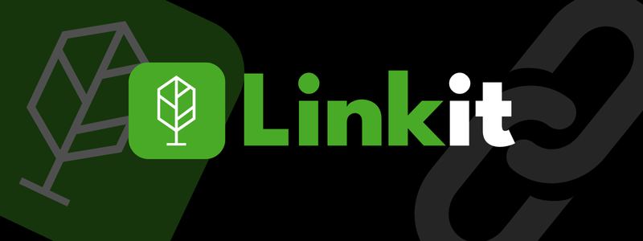
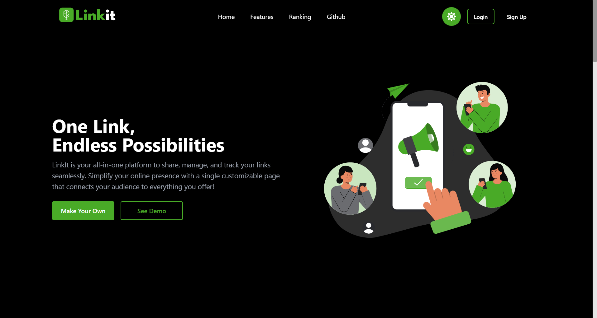
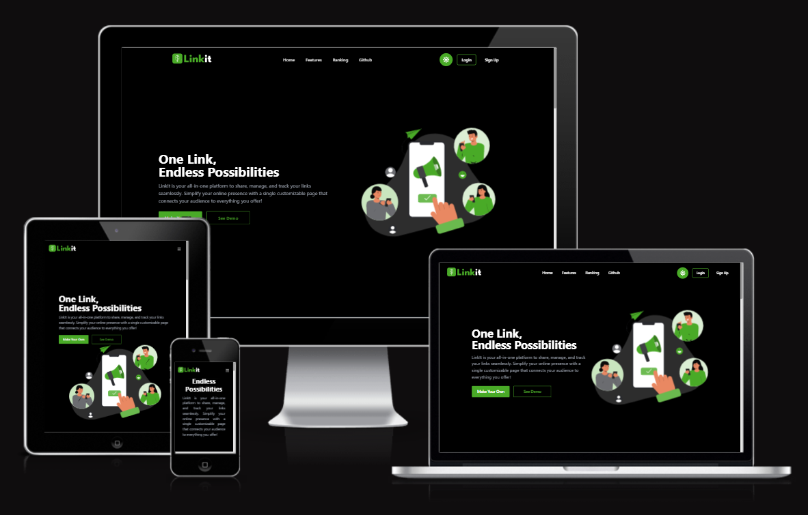

<div align="center">
  
</div>
<div align="center">
    
    
    
    
</div>

# 

<br>

**Linkit** is a user-friendly platform that allows you to collect and organize all your links into a single, interactive link page. With features like customizable designs and ranking functionalities, **Linkit** makes it easy to share your curated content in style. Whether you're an individual looking to showcase your portfolio or a business aiming to boost visibility, **Linkit** provides an engaging and responsive experience for your audience.


<br>

<div style="display: flex;">
  
  
</div>


<br>

## Deployed Application

You can access the deployed application here: [Linkit Deployed App](https://linkit-97du.vercel.app/)

<br>

## Table of Contents

- [Key Features](#key-features)
- [Project Structure](#project-structure)
- [Environment Variables](#environment-variables)
- [How To Use This Project](#how-to-use-this-rroject)
- [Check Responsive](#check-responsive)
- [Storage Schema](#storage-schema)
- [Concepts Used](#concepts-used)
- [Future Scope](#future-scope)

<br>

## Key Features

- **Custom Dashboard**: Generate a personalized dashboard displaying all your links in one place.  
- **Public Profile Link**: Share a single, interactive public profile link that aggregates all your links with a visually appealing design.  
- **Link Generation**: Easily create and manage all your links after registering and signing in to your account.  
- **User Authentication**: Login and signup functionality with secure data handling using JWT for authentication.  
- **Link Management**: Edit, delete, and organize your links effortlessly, with options to categorize or rank them.  
- **Ranking System**: Highlight your most important or popular links using a customizable ranking system.  
- **Responsive Design**: Ensures a seamless and interactive experience across devices, from desktops to mobile phones.  


<br>

## Project Structure 

```bash
backend/
├── controllers/
│   ├── linkController.js      # Handles logic for link-related operations
│   ├── userController.js      # Handles logic for user-related operations
├── helpers/
│   ├── jwtHelper.js           # Utility functions for handling JWTs
├── middlewares/
│   ├── authMiddleware.js      # Middleware for authentication and token validation
│   ├── upload.js              # Handles file upload configurations (e.g., Multer, Cloudinary)
├── models/
│   ├── links.js               # Schema and model for managing links
│   ├── user.js                # Schema and model for managing users
├── routes/
│   ├── linkRoutes.js          # Defines API endpoints for link-related actions
│   ├── userRoutes.js          # Defines API endpoints for user-related actions
├── node_modules/              # Dependencies (auto-generated by npm install)
├── .env                       # Environment variables (e.g., database URL, secrets)
├── .gitignore                 # Files and folders to ignore in Git
├── package.json               # Project metadata and dependencies
├── package-lock.json          # Locked dependency tree
├── vercel.json                # Setup json file for hosting backend on vercel
└── server.js                  # Entry point for starting the backend server
```

```bash
frontend/
├── public/
│   ├── index.html          # Main HTML file for the app
│   ├── logo192.png         # Logo used for the app
│   ├── manifest.json       # Web app manifest file
│   └── robots.txt          # Instructions for web crawlers
├── src/
│   ├── components/         # Reusable UI components
│   │   ├── button.js       # Button component
│   │   ├── copyLink.js     # Copy link component
│   │   ├── darkButton.js   # Dark button component
│   │   ├── features.js     # Features section component
│   │   ├── github.js       # GitHub integration component
│   │   ├── hero.js         # Hero section component
│   │   ├── imageSection.js # Image section component
│   │   ├── linkitLogo.js   # Linkit logo component
│   │   ├── particles.js    # Particle animation component
│   │   └── rankings.js     # Rankings component
│   ├── constants/          # Constants used across the app
│   │   └── FooterData.js   # Data for the footer component
│   ├── pages/              # Page components (views)
│   │   ├── Dashboard.js    # Dashboard page
│   │   ├── Footer.js       # Footer section
│   │   ├── FooterLinkSec.js # Footer links section
│   │   ├── Land.js         # Landing page
│   │   ├── Login.js        # Login page
│   │   ├── NotFound.js     # 404 page
│   │   ├── PublicPage.js   # Public page
│   │   ├── Rankings.js     # Rankings page
│   │   └── Register.js     # Registration page
│   ├── utils/              # Utility functions
│   │   ├── api.js          # API service
│   │   └── images/         # Image assets
│   ├── App.js              # Main app component
│   ├── App.test.js         # App component tests
│   ├── index.js            # Entry point for React app
│   ├── index.css           # Global CSS
│   ├── reportWebVitals.js  # Performance measurement
│   ├── setupTests.js       # Test setup
├── .gitignore              # Git ignore file
├── package-lock.json       # Dependency lock file
├── package.json            # Project metadata and dependencies
├── postcss.config.js       # PostCSS configuration
├── README.md               # Project documentation
└── tailwind.config.js      # Tailwind CSS configuration

```

[🔝](#table-of-contents)
<br>

## Environment Variables

The application requires the following environment variables to be set in a `.env` file. Below is a list of the required variables and their descriptions:

| Variable                  | Description                                                                 |
|---------------------------|-----------------------------------------------------------------------------|
| `MONGODB_URI`             | The connection string for your MongoDB database.                          |
| `JWT_SECRET`              | Secret key for signing and verifying JWTs (used for authentication).      |
| `PORT`                    | The port on which the backend server runs (default: `5000`).              |
| `FRONTEND_URL`            | The URL of the frontend application (e.g., `http://localhost:3000`).      |
| `CLOUDINARY_CLOUD_NAME`   | The cloud name for your Cloudinary account (used for image management).   |
| `CLOUDINARY_API_KEY`      | API key for your Cloudinary account.                                       |
| `CLOUDINARY_API_SECRET`   | API secret for your Cloudinary account.                                   |

### Example `.env` File

Below is an example of how your `.env` file should look:

```plaintext
MONGODB_URI=mongodb+srv://<username>:<password>@cluster0.mongodb.net/mydatabase
JWT_SECRET=your_jwt_secret_key
PORT=5000
FRONTEND_URL=http://localhost:3000
CLOUDINARY_CLOUD_NAME=your_cloud_name
CLOUDINARY_API_KEY=your_api_key
CLOUDINARY_API_SECRET=your_api_secret
```
[🔝](#table-of-contents)
<br>

## How to Use This Project

### Prerequisites:
- Make sure you have [Node.js](https://nodejs.org/en/) installed.
- A GitHub account to clone the repository.
- A [MongoDB Atlas](https://www.mongodb.com/atlas) account to set up the database.
- (Optional) A text editor like [VS Code](https://code.visualstudio.com/).

### Steps to Get Started:

1. **Clone the Repository:**
   Open your terminal and run the following command:
   ```bash
   git clone https://github.com/priyamaggarwal18/Linkit.git
   ```
   
2. **Navigate to the Project Directory:**
   Once the repository is cloned, navigate to the project folder:
   ```bash
   cd Linkit
   ```
3. **Navigate to Frontend and Backend Folders:**
   Navigate to both `frontend` and `backend` directories individually and install dependencies by running:
   ```bash
   cd frontend
   npm install
   ```
   Then, in another terminal:
   ```bash
   cd backend
   npm install
   ```
4. **Run the Project:**
   Start both the frontend and backend servers by running:
   ```bash
   npm start
   ```
   The frontend will be available locally on `http://localhost:3000` and the backend on `http://localhost:5000`.


[🔝](#table-of-contents)

<br>

## Check Responsive

Linkit is designed to ensure a seamless experience across all devices. Click the image below to view the app's responsive design in action.


<div align="center">
  <a href="https://ui.dev/amiresponsive?url=https://linkit-97du.vercel.app/" target="_blank">
    
  </a>
</div>


[🔝](#table-of-contents)

<br>

## Storage Schema

<div align="left">
  
</div>

[🔝](#table-of-contents)

<br>

## Concepts Used

- **MERN Stack**: Built using MongoDB Atlas, Express.js, React, and Node.js, hosted entirely on Vercel.  
- **Cloudinary Integration**: Used Cloudinary for efficient image storage with automatic optimization.  
- **Multer Middleware**: Handled file uploads and integrated them with Cloudinary using Multer.  
- **Environment Variables**: Secured sensitive data in `.env` files for both backend and frontend.  
- **Dynamic UI Updates**: Managed user interactions and real-time updates using React event handling.  
- **Responsive Design**: Ensured responsiveness with Tailwind CSS, Grid, and Flexbox utilities.  
- **Data Validation**: Validated user input, ensuring all URLs are correctly formatted before use.  
- **User Authentication**: Secured authentication and authorization using **JWT** to protect routes.  
- **Password Hashing**: Encrypted user passwords securely in the database using **bcrypt**.  
- **Analytics Integration**: Provided link performance analytics such as clicks and rankings.  
- **Error Handling**: Centralized error handling for consistent API responses in the backend.


[🔝](#table-of-contents)


<br>

## Future Scope

To make **Linkit** even more powerful and efficient, the following enhancements are planned:

- **Scalability**: Optimize the architecture to handle a growing user base and large volumes of links seamlessly.  
- **Customization**: Allow users to personalize their dashboards, themes, and link appearances for a tailored experience.  
- **Ad Revenue**: Introduce ad placements and premium features to generate revenue while keeping core functionalities free for users.

[🔝](#table-of-contents)
<br>
